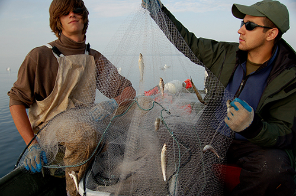

```{r github-auth-2, echo = FALSE, out.width="50%", fig.cap = "Fish catches in the Great Lakes"}

```

```{r load-pkg, message = FALSE}
library(tidyverse)
library(skimr)
```

## Data

The data for this exercise come from the [Great Lakes Database](http://www.glfc.org/great-lakes-databases.php) which provides information about fish caught annually (annual fish catches) in the Great Lakes (Michigan, Huron, Superior, Erie, Ontario) for the last 150 years.
The Great Lakes have been hit by numerous major ecological changes during this period, including invasion by alewife herring (1950s), introduction of pacific salmon (e.g., chinook; 1970s), and later invasion by quagga and zebra mussels (1990s).
If you're interested in this topic I would recommend the book *The Death and Life of the Great Lakes* by Dan Egan.

```{r load-data, message = FALSE, warning = FALSE}
# From TidyTuesday: https://github.com/rfordatascience/tidytuesday/blob/master/data/2021/2021-06-08/readme.md
catch_data <- readr::read_csv('https://raw.githubusercontent.com/rfordatascience/tidytuesday/master/data/2021/2021-06-08/fishing.csv')
```

## Exercises

**Remember, for ungraded class exercises such as these, just complete the code chunks in this document and knit. Don't commit or push your changes. You're all working from the same repo.**

### Exercise 1.

Warm up!
Take a look at an overview of the first dataset `catch_data` with the `skim()` function.
The `skim()` function provides even more information than the `glimpse()` function.
Look at the output tables and think about what each column may be referring to.

**Note:** I already gave you the answers to this exercise.
You just need to knit the document and view the output.
A definition of all variables is given in the [Data dictionary] section at the end, though you don't need to familiarize yourself with all variables in order to work through these exercises.

```{r catch_data-skim}
skim(catch_data)
```

**Note:** Remember you can also use `glimpse()` to take a look at a dataset.

### Exercise 2.

Which species and years are associated with the largest total U.S fish catches from Lake Michigan?

Let's see...

Fill in the blanks for filtering for Great Lakes annual fish catch where the region is from the US (`region` code `"U.S.Total"`) and the lake is Lake Michigan (`lake` code `Michigan`).
Then pipe the results into the `slice_max()` function we have used before, so we can select the 5 years with the largest catch (coded as production `values`).
Note: production `values` are rounded to the nearest thousand pounds.

**Note:** You will need to change `eval=FALSE` to `eval=TRUE` in the top line of the chunk for any code chunks you want to run (evaluate).

Hint: The boolean (logical) operator for "equals to" is `==`.

```{r largest-catches, eval=FALSE}
catch_data %>%
  filter(
    lake ___ "___",
    region ___ "U.S. Total"
    ) %>% 
  slice_max(
    order_by = ___, 
    n = 5
      )
```

**Tip:** If you are working with a large dataset like `catch_data`, and there are character class variables (e.g., \`region\`\`), you can quickly see what different character strings (regions) are in the dataset by converting the characters to factors (i.e. categorical data), then looking at the levels.
Here's some code to try:

```{r region-levels}
factor(catch_data$region) %>%  # first converts the region variable from character to factor class
  levels() # then looks at what levels the factor variable takes (i.e. the different categories)
```

### Exercise 3.

What were the largest fish catches before 1950?

1.  Arrange the answer in descending order.
2.  Slice out only the top 5 largest catches.
3.  Select only the year, species, and values columns.

**Note:** The `values` data are reported to the nearest whole 1,000 lbs, so add 3 zeros to any number in the `values` column.

**Note:** You will need to set `eval=TRUE` when you have an answer you want to try out.

```{r big-fish-catches, eval=FALSE}
catch_data %>%
  filter(
    region ___ "U.S. Total",
    year ___ 1950
    ) %>% 
  arrange(___) %>% 
  slice(___) %>% 
  select(___)
```

From here on, we'll continue only using catch data from the "U.S. Total" `region`.
To avoid having to filter each time, let's create a new dataframe `fishing_us` from `fishing` that only includes the data we want:

```{r ustotal-dataframe}
catch_data_us <- catch_data %>% 
  filter(
    region == "U.S. Total"
  )
```

### Exercise 4.

Do you think annual U.S. fish catches are larger in Lake Michigan now, compared to 1975?

Test your intuition with data...

Use `filter()` to get data on *total U.S. catches* from *Lake Michigan* in the years *2015* and *1975*.
Use `arrange()` to identify the largest fish catches for those years.
Simplify your output by using `select()` to select only `year`, `species`, and `values`.

```{r 1975-comparison}
# add code here
# pay attention to correctness and code style
```

Was your intuition correct?

Although we normally tidy up data by pivoting longer, as a final step, use `pivot_wider()` to allow you to compare the catch in 1975 with that in 2015 in a single row.
You will need to specify the "names_from" and "values_from" arguments.

```{r 1975-comparison-wide}
# add code here
```

### Exercise 5.

Use the `distinct()` function to find out how many years there are in the dataset:

```{r distinct-years}
# add your code here
```

Now pipe the output to `arrange()` to arrange by descending order (from most recent to most distant year):

```{r distinct-years-arranged}
# copy and add your code here
```

### Exercise 6.

Use the `count()` function to confirm how many observations (rows) there are *per lake*:

```{r count-by-lake}
# add your code here
```

Now generate the same table, but this time use the `sort` argument in `count()` to sort in descending order:

```{r count-by-lake-sort}
# add your code here
```

Generate the same output, but this time using the `arrange()` function, rather than `sort` argument in `count()`:

```{r count-by-lake-arrange}
# add your code here
```

### Exercise 7.

Pacific Salmon species started being stocked in the Great lakes during the 1970s, for commercial fishing and to reduce the large `Alewife` populations.
Calculate summary statistics (minimum, mean, median, maximum) for the size of the `Chinook Salmon` catch in Lake Michigan over all available years of data.

-   Use `filter()` to get data on the Lake Michigan and the Chinook Salmon species
-   Use `summarize()` to calculate the summary stats across all available years

**Note:** Don't forget to label your R chunk as well (where it says `label-me-1`).
Your label should be short, informative, and shouldn't include spaces.
It also shouldn't repeat a previous label, otherwise R Markdown will give you an error about repeated R chunk labels.

```{r label-me-1}
# add code here
# pay attention to correctness and code style
```

### Exercise 8.

Use the maximum catch result you got in the last exercise to filter for the `year` the largest `Chinook Salmon` catch was made in Lake Michigan.

-   Use the `filter()` part of the code from Exercise 5, but add one more filtering argument to select the year of the maximum catch.

Remember to label the chunk again.

```{r label-me-2}
# add code here
# pay attention to correctness and code style
```

### Exercise 9.

In the 1980s, invasive mussel species were introduced to the Great Lakes, likely via ballast water discharges into the Lakes from large vessels.
The mussels went on to radically change the ecology of the Lakes, including causing a collapse in the Great Lakes fisheries.

Sum the total Lake Michigan catch (including all species) in the years 1975, 1985, 1995, 2005, and 2015.

-   You can filter using a vector of numbers rather than a single number by using `%in%` where you would normally put the logical operator `==` . For instance, for the three years 1999, 2000, and 2001 you would use: `filter(year %in% c(1999, 2000, 2001))`.
-   After filtering, you'll need to use `group_by()` to compute the sums by year.

```{r label-me-3}
# add code here
# pay attention to correctness and code style
```

What does the trend in the values show?
During which 10 year period was there the largest **change** in fish catch?

### Exercise 10.

In an earlier exercise, we told you that the variable values (catch size) was in units of nearest 1000 lbs.
It can be a bit confusing to constantly add three zeros mentally to the values column.
Use `mutate()` to create a new column called `annual_catch_lbs` which expressed the catch size in lbs, rather than 1000s of lbs.

```{r label-me-4}
# add your code here
```

Finally, save the new version of the `catch_data` dataset that includes `annual_catch_lbs` in the code chunk below, using the assignment operator (`<-`) to assign your output to `catch_data_v2`.

```{r label-me-5}
# add your code here
```

## Data dictionary

Below is the full data dictionary.
Note that it is long (there are lots of variables in the second dataset), but we will be using a limited set of the variables for our analysis.

### fishing.csv

| variable    | class     | description                                                         |
|:------------|:----------|:--------------------------------------------------------------------|
| year        | double    | Year of measurement                                                 |
| lake        | character | Lake Name                                                           |
| species     | character | Species of fish                                                     |
| grand_total | double    | Grand total of observed                                             |
| comments    | character | Comments from the dataset providers                                 |
| region      | character | Region of the US/Canada, note there is some inconsistency           |
| values      | double    | Production amounts have been rounded to the nearest thousand pounds |
